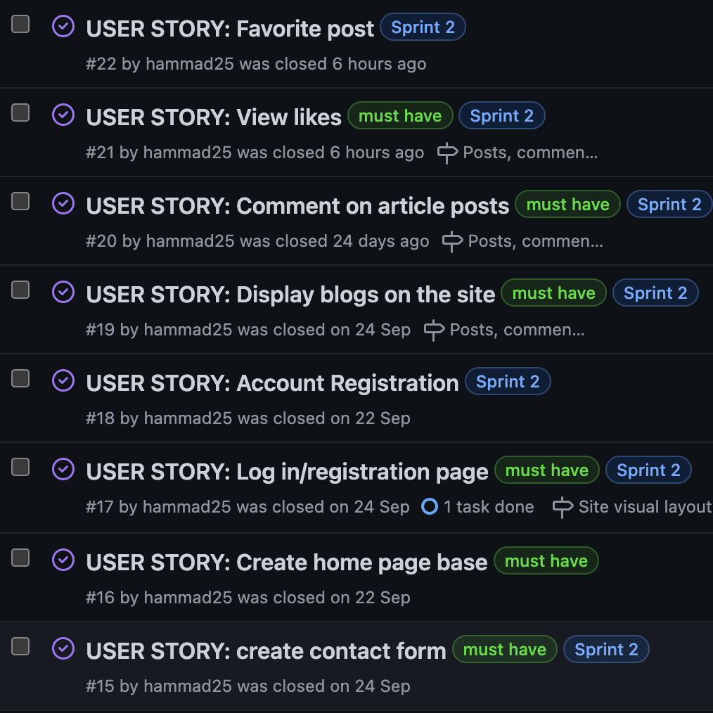

# **Wabi-Sabi**
A blog on the art and life philosophy of Wabi Sabi. As the world around us becomes ever so chaotic, this blog is a reminder to ourselves to adopt a more grounded and pure way of living. 

This blog post aims to bring content on the philosophy of Wabi Sabi to the reader, and form and community where individuals can can interact with the content, each other and allow individulas to use a contact form to get in touch with me!

Live link can be found here [Deployed site]()

# **Table Of Contents**
* [**Wabi-SAbi**](#Wabi-Sabi)
* [**Purpose of the project**](#Purpose-of-the-project)
* [**User Stories:**](#user-stories)
* [**Surface**](#surface)
    * [**Color scheme:**](#color-scheme)
    * [**Typography**:](#typography)
  * [**Skeleton**](#skeleton)
    * [**Wireframes:**](#wireframes)
    * [**Database Schema**](#database-schema)
* [**Agile Development Process**](#agile-development-process)
* [**Features**](#features)
* [**Future development**](#future-development)
* [**Technologies used**](#technologies-used)
* [**Testing Phase**](#testing-phase)
* [**Deployment**](#deployment)
* [**Credits**](#credits)

### **User Stories:**  
### **User Stories dropped as part of the agile process**
* As an **Admin** I can...
 - As a Site Admin I can open the admin page to create new content and publish them.
 - As a Site Admin I can save posts as drafts in order to continue editing or post content at a later date. 
  - As a Site Admin I have a post template in order to make new posts quickly under the same format.

* As a **Registered User** I can... 
- As a Registered User I can create a profile so that I can save key details 
- As a Registered User I can Log in or Log out in order to keep my account secure.
- As a Registered User I can like a post in order to show that I enjoyed the content.
 - As a Registered User I can comment on blog posts in order to interact with other site users and the site owner. 
 - As a Registered User I can Access a Profile Page in order to View/Update my information.
 - As a Registered User I can Click an edit button in order to Update/correct/edit comments that I've made.
 - As a Registered User I can click on a delete button to delete my comment
 - As a Registered User I can click an edit button on my profile in order to Edit/change information about me.
 - As a Site User I can delete my account in order to remove myself from the website database if I no longer use the site

* As a **Site User** I can...
- As a Site User I want to explore Wabi-sabi so I can implement it in my life
- As a Site User I can view a selection of paginated posts so that I can decide which posts I want to read.
- As a Site User I can click on a post in order to read the content from the post I selected.
- As a Site User I can create an account in order to have access to features that I wouldn't have otherwise. 
- As a Site User I can Contact the Site owner directly in order to ask questions or discuss opportunities. 
- As a Site User I can open a dedicated social media page in order to view social media links from one location. 

# **Planning Phase**

## **Structure**   
Note: In production I decided to add a favourite field to Post and instead of using FavoritePost for favourite post functionality

## **Wireframes:**
 

CLICK TO OPEN/HIDE WIREFRAMES

I used Balsamiq to create my wireframes.

## Home Page

## Home mobile

## Profile

## Profile mobile

## Contact

## Articles

### **Typography**:
- For the color layout I decided to keep it very clean and chic, opting for the zin colors of black and white.

# **Agile Development Process**
## Agile Methodology
## Overview
For the development lifecycle of the project and planning, I used Github Porjetcs Kanban-style board to keep track of the issues as user stories, ideas and epics. I split user stories into different epics and tried to organize each user story underneath a specific epic. I used different labels to assign priority to issues as I worked though them. To simplific the workflow I split the flow of the process using sprints in line with an agile methodology. 

Link to the board below:
[Wabi Sabi Kanban Board](https://github.com/users/hammad25/projects/8)

### Sprint 0 notes:
- Before I started my sprint I laid the foundation first, I designed the  Database, wrote requirements that I wanted the project to have and finally created the wireframes

### Sprint 1 notes:
- The first sprint was getting the initially deployment done, installing the right components and attaching the database to heroku. 
- Creating the superuser to be able to get access to the django admin page to be able to set up the models

### Sprint 2 notes:
- This sprint was getting in the prime functionality step by step. This included setting the functionality and and subsequent front end interactivity and styling

### Sprint 3 notes:
- Sprint 3 was getting in the documentation.

# **Features**
The Wabi Sabi website has many different features that make the project fun and interactive.
- A navbar for site navigation and active link indications as to which page the user is on
- Call to action buttons that guide the user to sign up
- A Sign up page, where users can create an account
- The articles page that features different blog post that jump up when hovered over them
- The blog post have a comments section towards the end of the post where registered users can leave a comment
- The blog post also have a bookmark button for users to favourite an article that saves within their profile favourites page
- A like button to express positive affirment if they enjoy the content
- A comments count showing how many comments an article currently has
- Comment delete and update buttons
- Profile edit page where users can edit info
- Profile delete button to delete their profile from the database 

## **Future features**
- Search articles based on category type

# **Testing Phase**
I have included testing details during and post-development in a separate document called [TESTING.md](TESTING.md).

# **Deployment**
The final Deployed site can be found [here](https://jobs-a-gooden.herokuapp.com/)
I have included details of my initial deployment in a separate document called [DEPLOYMENT.md](DEPLOYMENT.md).

# **Technologies used**
* Python
  * The packages installed for the is project can be found in [the requirements.txt](requirements.txt)
* Django
  * Django was used as the python framework in the project.
  * Django all auth was used to handle user authentication and related tasks i.e. sign in, sign up, sign out.
* Heroku
  * Used to deploy the page and make it publicly available.
* Heroku PostgreSQL
  * Used for the database during development and in deployment.
* HTML
  * HTML was the base language used to layout the skeleton of all templates.
* CSS
  * Custom CSS used to style the page and make the appearance look a little more unique.
* Javascript
  * I have used Javascript throughout to manipulate the DOM and communicate to the backend to create, read, update, and delete data from the database.
* Jinja
  * Jinja was the templating language used in order to implement the views.py logic and models.py data into a template so it could be displayed to the user.
* Bootstrap 5.1.3
  * Used to style HTML, CSS, minor javascript. The more I used this framework the most I realized retrospectively how it could have saved me writing several parts of the code I had already written.
* Font awesome
  * All icons throughout the page.

Oliver has been my reason for the change, and Analise my inspiration. 
  
# Credits
* Balsamiq was used to create the wireframes.
* GitHub was used to store my repository.
* Fonts were taken from [Google Fonts](https://fonts.google.com/)
* Images:
  * [upsplash.com](https://unsplash.com) 

