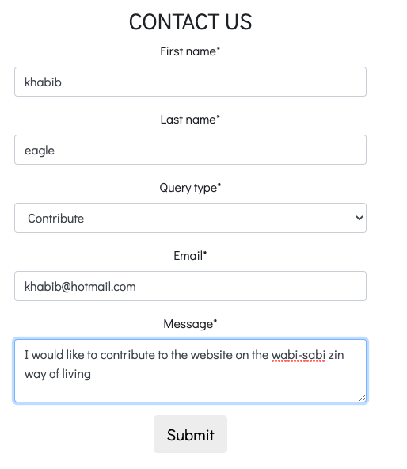
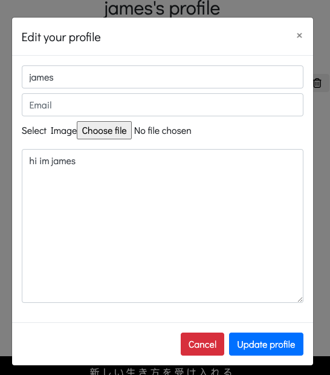

# Testing 
Through out the process I have used my User stories to test for relavent functionality
## Test cases
### Site User
- As a Site User I want to explore Wabi-sabi so I can implement it in my life

- As a Site User I can view a selection of paginated posts so that I can decide which posts I want to read.

- As a Site User I can click on a post in order to read the content from the post I selected.

- As a Site User I can create an account in order to have access to features that I wouldn't have otherwise. 

- As a Site User I can Contact the Site owner directly in order to ask questions or discuss opportunities. 
- Django forms was used to create the contact form hence there is built in validation

- As a Site User I want verification was contact form request has been submitted

- As a Site User I can open a dedicated social media page in order to view social media links from one location.

### Registered User 
- As a Registered User I can Log in or Log out in order to keep my account secure.

- As a Registered User I can create a profile so that I can save key details
- As a Registered User I can click an edit button on my profile in order to Edit/change information about me.
- Django allauth has been used to create registe/log-in and log-out fuctionailty has built in validation

- As a Registered User I can Access a Profile Page in order to Update my information.

- As a Site User I can delete my account in order to remove myself from the website database if I no longer use the site

- As a Registered User I can like a post in order to show that I enjoyed the content.

- As a Registered User I can comment on blog posts in order to interact with other site users and the site owner. 

- As a Registered User I can click an edit button in order to edit and update comments that I've made.

- As a Registered User I can click on a delete button to delete my comment

- As a Registered User I can click the bookmark button in order to save the post

- As a Registered User I can view the bookmark posts 

### As an Admin
- As a Site Admin I can open the admin page to create new content and publish them or save them in draft

# Python validation
- The pep8 validator was not working, so I used the built in pip3 install pep8 and then pylint manage.py to check the quality of code

# Validators
## [HTML](https://validator.w3.org):
- All pages were error free, however I found that the pasting the code in the Html checker gave me django specific errors such as the below. 

## [CSS](https://jigsaw.w3.org/css-validator/validator)
- No errors were found 

### Return to README: 
[README.md](README.md)

